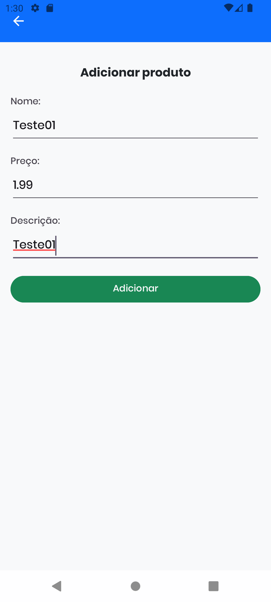
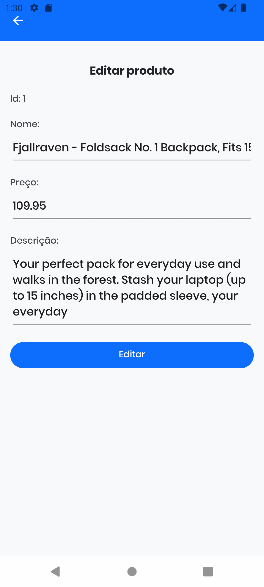
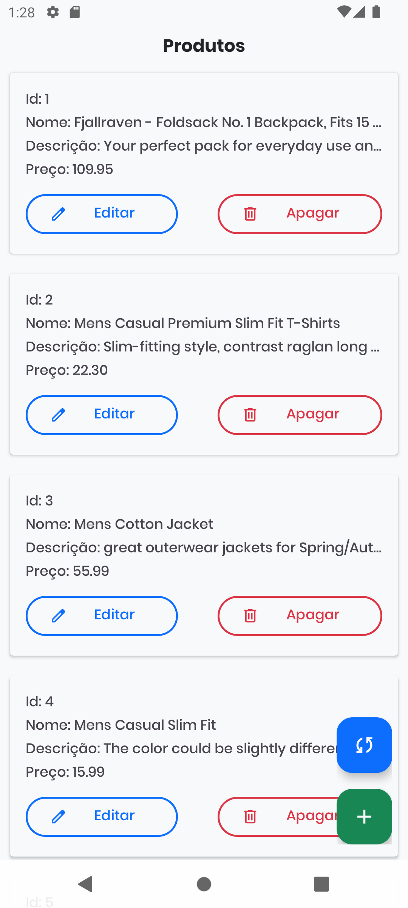
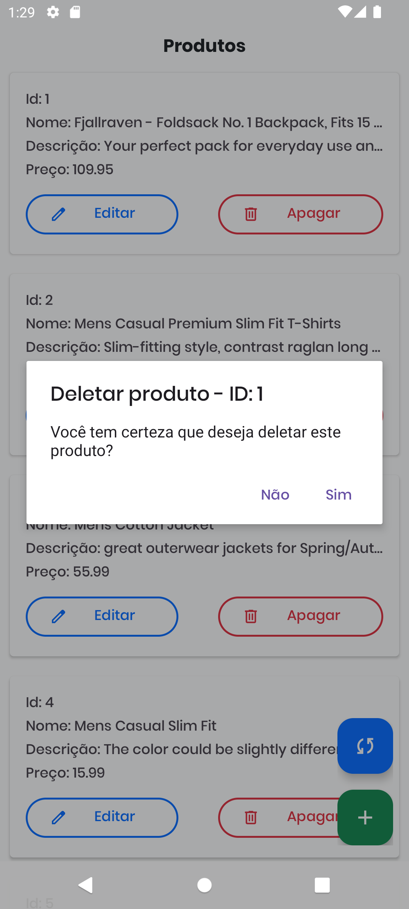

This repository contains the source code for an Android application developed in Kotlin. The application is a simple product list, where you can add, edit, and view products.

> Este repositório contém o código-fonte de um aplicativo Android desenvolvido em Kotlin. O aplicativo é uma simples lista de produtos, onde você pode adicionar, editar e visualizar produtos.

### 📱 APK Installation
> 📱 Instalação do APK

1. Download the application APK [here](https://drive.google.com/file/d/1Pk4w0kFLW3pWKf7rL-7eiNTcpDgLhB56/view?usp=sharing).
2. Open the APK file on your Android device.
3. Follow the on-screen instructions to install the application.

> 1. Baixe o APK do aplicativo [aqui](https://drive.google.com/file/d/1Pk4w0kFLW3pWKf7rL-7eiNTcpDgLhB56/view?usp=sharing).
> 2. Abra o arquivo APK no seu dispositivo Android.
> 3. Siga as instruções na tela para instalar o aplicativo.

### ⚙️ Running the Project
> ⚙️ Executando o Projeto

1. Make sure you have Android Studio installed on your computer. If not, you can download it [here](https://developer.android.com/studio).
2. Clone this repository to your computer using `git clone`.
3. Open the cloned project in Android Studio.
4. Make sure Android Studio has the correct Android SDK and Gradle installed.
5. In Android Studio, click on `Run > Run 'app'` to start the app on an emulator or connected device.

> 1. Certifique-se de ter o Android Studio instalado em seu computador. Se não, você pode baixá-lo [aqui](https://developer.android.com/studio).
> 2. Clone este repositório para o seu computador usando `git clone`.
> 3. Abra o projeto clonado no Android Studio.
> 4. Certifique-se de que o Android Studio tenha o SDK do Android e o Gradle corretos instalados.
> 5. No Android Studio, clique em `Run > Run 'app'` para iniciar o aplicativo em um emulador ou dispositivo conectado.

### 📝 Features and 📸 Screenshots
> 📝 Funcionalidades e 📸 Capturas de Tela

The application has the following functionalities:
> O aplicativo possui as seguintes funcionalidades:

- **Add Products:** Allows you to add new products to the list.
> - **Adicionar Produtos:** Permite adicionar novos produtos à lista.

- **Edit Products:** Allows you to edit existing product information.
> - **Editar Produtos:** Permite editar as informações de produtos existentes.

- **View Products:** Displays a list of all added products.
- **Synchronize Products:** Synchronizes products with the [Fake Store API](https://fakestoreapi.com/) for population and recreation of the local database (SQLite).
> - **Visualizar Produtos:** Exibe uma lista de todos os produtos adicionados.
> - **Sincorziar Produtos:** Sincroniza os produtos com a API da [Fake Store API](https://fakestoreapi.com/) para a população e recriação da base de dados local (SQLite).

- **Remove Products:** Allows you to remove products from the list.
> - **Remover Produtos:** Permite remover produtos da lista.

